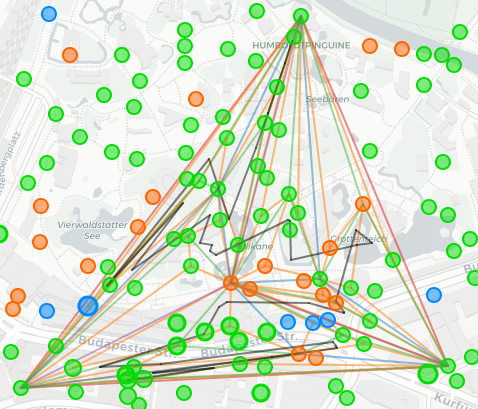

### Usage

- Requires IITC with DrawTools.
- Add the script to your browser.
- Scroll to a dense area.
- Open the HomoGen panel and click Start.
- Scroll the map around and Start again to find a better field.
- Repeat until happy.
- Export the result with DrawTools as usual. 



Links are colored according to nesting level, and the path to walk is black.

### Under the hood

The base for calculations is center of current viewport, and only visible portals are used. Three 120° sectors (A, B, C) are formed with inner portals sorted from the center outwards. The script checks a three-tuple of candidates (Ai, Bj, Ck) and increments i/j/k until the candidates form a valid homogeneous field.

If the search is successful, it draws the resulting field and a lazy fielding path. The fielding path doesn't account for ground obstacles but does limit the movement to 40m action radius, hence "lazy". Designed for low scale, high density operations (at the point when straight lines start to curve, `point_in_triangle` func might start lying).

### TODO

- Only builds L5 fields now. Add a dropdown to select required level.
- Only builds a bottom-base/top-tipped triangle now. Add a checkbox to search for a flipped triangle. Maybe even an "advanced settings" section for fine-tuning the angles.
- The fielding path is hardcoded (bottom > right > left > tip). It should be possible to compute alternatives, and give nice UI to switch between them.
- Fix `point_in_triangle` to use spherical geometry instead of planar.

### Development

I did not find a nice way to reload a userscript into Chrome for easy development. Current workaround:

1. Split the file into "loader" and "worker" at line 14.

2. Add this line to "loader":

   ```
   // @require      file:///path/to/worker.js
   ```

3. Give tampermonkey access to filesystem in browser extension settings.

4. Only put the loader into tampermonkey, it will fetch fresh worker on every page reload.

5. Stitch the loader and worker together and throw away the extra line when finished.
